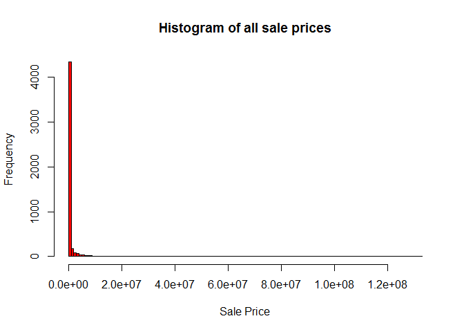
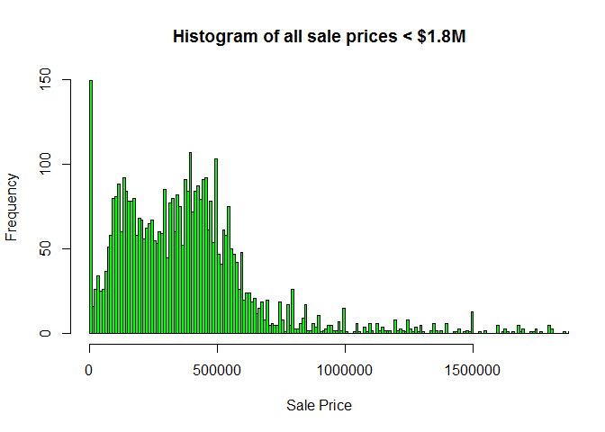
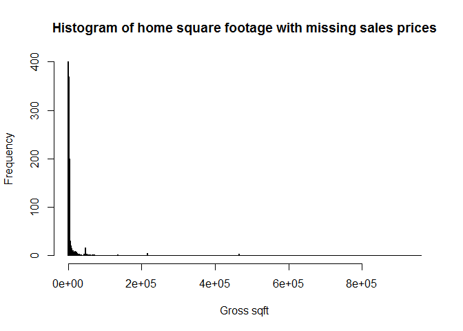
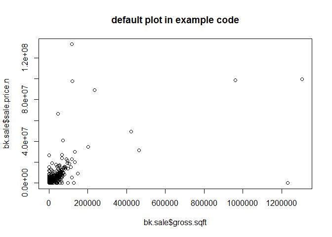
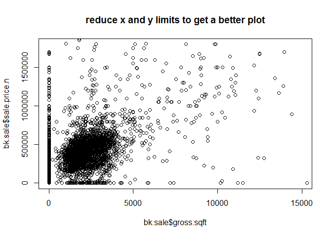
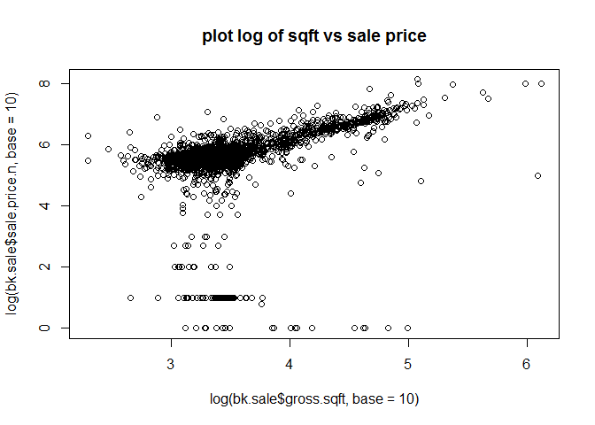
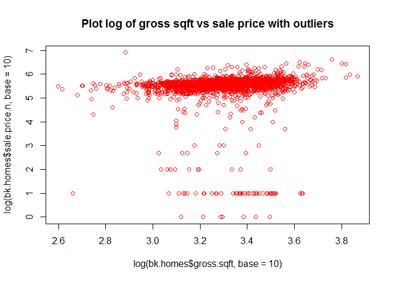
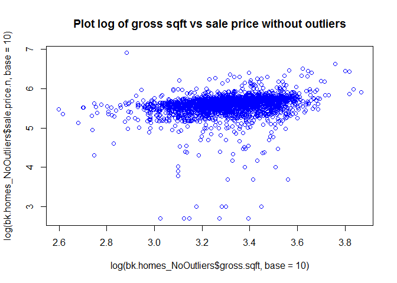

# TheBronxHousingCosts_Paper
Jose Quinonez, Randy Lisbona, Chris Boomhower  
May 31, 2016  

# Paper Intro
### This markdown writeup is meant to both link all project source code into one coherent project output and to also provide further details regarding all outputs.

# Gathering the Data
### By exploring the sale price and gross sqft data in histogram form, it is determined the data is heavily right skewed and that there are several outliers.

### When plotting the sale price with respect to gross sqft, it is difficult to determine the relationship. But, when comparing the log of each parameter, it is apparent they share an exponential relationship with one another. As gross sqft increases exponentially, sale price does as well.


```r
require(gdata)
```

```
## Loading required package: gdata
```

```
## gdata: Unable to locate valid perl interpreter
## gdata: 
## gdata: read.xls() will be unable to read Excel XLS and XLSX files
## gdata: unless the 'perl=' argument is used to specify the location
## gdata: of a valid perl intrpreter.
## gdata: 
## gdata: (To avoid display of this message in the future, please
## gdata: ensure perl is installed and available on the executable
## gdata: search path.)
```

```
## gdata: Unable to load perl libaries needed by read.xls()
## gdata: to support 'XLX' (Excel 97-2004) files.
```

```
## 
```

```
## gdata: Unable to load perl libaries needed by read.xls()
## gdata: to support 'XLSX' (Excel 2007+) files.
```

```
## 
```

```
## gdata: Run the function 'installXLSXsupport()'
## gdata: to automatically download and install the perl
## gdata: libaries needed to support Excel XLS and XLSX formats.
```

```
## 
## Attaching package: 'gdata'
```

```
## The following object is masked from 'package:stats':
## 
##     nobs
```

```
## The following object is masked from 'package:utils':
## 
##     object.size
```

```r
require(plyr) #Added by Monnie McGee
```

```
## Loading required package: plyr
```

```r
setwd("..")
setwd("Analysis/Data")
source("RollingSales_Gather.R")
```

```
## 'data.frame':	20113 obs. of  21 variables:
##  $ BOROUGH                       : int  2 2 2 2 2 2 2 2 2 2 ...
##  $ NEIGHBORHOOD                  : Factor w/ 39 levels "","BATHGATE                 ",..: 2 2 2 2 2 2 2 2 2 2 ...
##  $ BUILDING.CLASS.CATEGORY       : Factor w/ 37 levels "","01  ONE FAMILY DWELLINGS                    ",..: 2 2 2 2 2 2 2 3 3 3 ...
##  $ TAX.CLASS.AT.PRESENT          : Factor w/ 11 levels "","1","1A","1B",..: 2 2 2 2 2 2 2 2 2 2 ...
##  $ BLOCK                         : int  2905 2905 3035 3039 3039 3053 3053 2900 2912 2912 ...
##  $ LOT                           : int  28 28 2 36 36 86 102 61 117 118 ...
##  $ EASE.MENT                     : logi  NA NA NA NA NA NA ...
##  $ BUILDING.CLASS.AT.PRESENT     : Factor w/ 108 levels "","A0","A1","A2",..: 10 10 90 90 90 89 3 91 11 11 ...
##  $ ADDRESS                       : Factor w/ 5931 levels "","1 ANGELAS PLACE                          ",..: 1322 1322 4279 4369 4369 2333 2294 4028 1116 1120 ...
##  $ APARTMENT.NUMBER              : Factor w/ 205 levels "","            ",..: 2 2 2 2 2 2 2 2 2 2 ...
##  $ ZIP.CODE                      : int  10457 10457 10457 10458 10458 10458 10458 10457 10457 10457 ...
##  $ RESIDENTIAL.UNITS             : int  1 1 1 1 1 1 1 2 2 2 ...
##  $ COMMERCIAL.UNITS              : int  0 0 1 1 1 2 0 1 0 0 ...
##  $ TOTAL.UNITS                   : int  1 1 2 2 2 3 1 3 2 2 ...
##  $ LAND.SQUARE.FEET              : int  4750 4750 1287 2500 2500 1911 919 1855 2000 2000 ...
##  $ GROSS.SQUARE.FEET             : int  2619 2619 2528 2452 2452 4080 1248 4452 2400 2400 ...
##  $ YEAR.BUILT                    : int  1899 1899 1899 1910 1910 1931 1901 1931 1993 1993 ...
##  $ TAX.CLASS.AT.TIME.OF.SALE     : int  1 1 1 1 1 1 1 1 1 1 ...
##  $ BUILDING.CLASS.AT.TIME.OF.SALE: Factor w/ 109 levels "","A0","A1","A2",..: 10 10 91 91 91 90 3 92 11 11 ...
##  $ SALE.PRICE                    : Factor w/ 1555 levels ""," $-   "," $1 ",..: 2 2 2 2 903 2 2 869 1074 2 ...
##  $ SALE.DATE                     : Factor w/ 301 levels "","1/1/2016",..: 275 275 85 260 229 135 10 118 158 80 ...
```

<!-- --><!-- --><!-- -->

```
## 'data.frame':	20113 obs. of  24 variables:
##  $ borough                       : int  NA NA NA NA 2 NA NA 2 2 NA ...
##  $ neighborhood                  : Factor w/ 39 levels "","BATHGATE                 ",..: NA NA NA NA 2 NA NA 2 2 NA ...
##  $ building.class.category       : Factor w/ 37 levels "","01  ONE FAMILY DWELLINGS                    ",..: NA NA NA NA 2 NA NA 3 3 NA ...
##  $ tax.class.at.present          : Factor w/ 11 levels "","1","1A","1B",..: NA NA NA NA 2 NA NA 2 2 NA ...
##  $ block                         : int  NA NA NA NA 3039 NA NA 2900 2912 NA ...
##  $ lot                           : int  NA NA NA NA 36 NA NA 61 117 NA ...
##  $ ease.ment                     : logi  NA NA NA NA NA NA ...
##  $ building.class.at.present     : Factor w/ 108 levels "","A0","A1","A2",..: NA NA NA NA 90 NA NA 91 11 NA ...
##  $ address                       : Factor w/ 5931 levels "","1 ANGELAS PLACE                          ",..: NA NA NA NA 4369 NA NA 4028 1116 NA ...
##  $ apartment.number              : Factor w/ 205 levels "","            ",..: NA NA NA NA 2 NA NA 2 2 NA ...
##  $ zip.code                      : int  NA NA NA NA 10458 NA NA 10457 10457 NA ...
##  $ residential.units             : int  NA NA NA NA 1 NA NA 2 2 NA ...
##  $ commercial.units              : int  NA NA NA NA 1 NA NA 1 0 NA ...
##  $ total.units                   : int  NA NA NA NA 2 NA NA 3 2 NA ...
##  $ land.square.feet              : int  NA NA NA NA 2500 NA NA 1855 2000 NA ...
##  $ gross.square.feet             : int  NA NA NA NA 2452 NA NA 4452 2400 NA ...
##  $ year.built                    : num  NA NA NA NA 1910 ...
##  $ tax.class.at.time.of.sale     : int  NA NA NA NA 1 NA NA 1 1 NA ...
##  $ building.class.at.time.of.sale: Factor w/ 109 levels "","A0","A1","A2",..: NA NA NA NA 91 NA NA 92 11 NA ...
##  $ sale.price                    : Factor w/ 1555 levels ""," $-   "," $1 ",..: NA NA NA NA 903 NA NA 869 1074 NA ...
##  $ sale.date                     : Date, format: NA NA ...
##  $ sale.price.n                  : num  NA NA NA NA 400000 NA NA 399000 493000 NA ...
##  $ gross.sqft                    : num  NA NA NA NA 2452 ...
##  $ land.sqft                     : num  NA NA NA NA 2500 ...
```

<!-- --><!-- --><!-- -->

# Merging the Data
### After cleaning the data, only data related to 1, 2, and 3-family homes is assigned to a data frame for further analysis.


```r
getwd()
```

```
## [1] "C:/Users/Owner/Documents/GitHub/MSDS_6306/LiveSessionHW3-4/TheBronxHousingCosts/Paper"
```

```r
setwd("..")
setwd("Analysis/Data")
source("RollingSales_MergeData.R")
```

#Analysis
### By plotting the log of 1, 2, and 3-family dwelling data, it is observed there is an exponential relationship between sale price and gross sqft. As gross sqft increases exponentially, sale price does as well. The plots of log data also provide clear indication that the original data had many outliers. By removing the outliers, only valid data can be reviewed further. While the author chose to remove the outliers from the original data, we chose to leave the outliers to embarass the individuals who conducted this study.


```r
setwd("..")
setwd("Analysis")
source("RollingSales_Analysis.R")
```

<!-- --><!-- -->

# Future activities
### We learned that setting the same local directory path on each team members PC is important for sharing code.  We didn’t do this and had trouble running the code pulled from git hub locally without tweaks to directory paths. We also discovered that Rmarkdown resets the working directory between each code chunk.  We attempted to set a global directory but could not determine correct syntax.  In the interest of time, we chose the brute force method of specifying the working directory in each code chunk.
